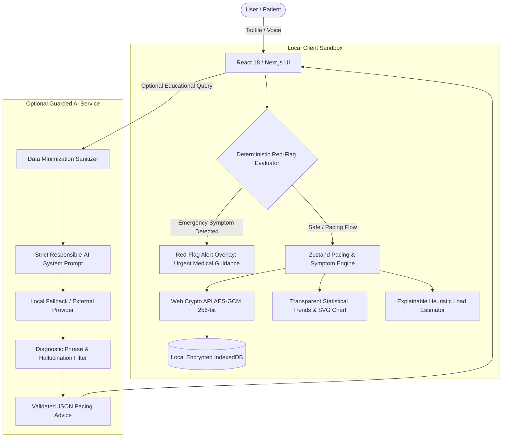

# CerebroCalm

> **"Less screen. Less cognitive load. More clarity. More privacy."**

A privacy-first, low-cognitive-load recovery companion for concussion and mild Traumatic Brain Injury (TBI) recovery.

Developed for:
- 🏆 **Best Tech for Concussion Recovery**
- 🏆 **Best Use of AI/ML & Responsible AI**
- 🏆 **Best Design**

---

## 1. Problem Statement
Recovering from a concussion or mild traumatic brain injury (TBI) presents a painful paradox: patients are frequently instructed to log symptoms, pace cognitive exertion, and follow multi-phase return-to-activity protocols, yet modern digital health apps are full of bright glare, rapid animations, dense analytical charts, and cognitive complexity that **directly exacerbate photophobia, headache, and mental fatigue**.

Furthermore, neurological recovery data is intensely private. Patients frequently report hesitation entering vulnerable cognitive metrics into cloud-connected apps that monetize or centralize sensitive health records.

---

## 2. Solution: CerebroCalm
**CerebroCalm** reimagines concussion recovery software from the ground up:
1. **Photophobia-Conscious Design**: Strict avoidance of pure black (`#000000`) and pure white (`#FFFFFF`). Warm stone and muted amber tones minimize screen glare.
2. **5-Second Tactile Check-In**: Single-screen 1–5 scale inputs with large hit targets and optional on-device voice transcription.
3. **Smart Cognitive Pacing**: Scheduled activity intervals with automatic transition into **Dark Sanctuary**—a screenless sensory rest room with 4-4-4-4 box breathing.
4. **Deterministic Safety Architecture**: Hard-coded red-flag emergency screening (vomiting, seizure, slurred speech, worsening severe headache) that **supersedes all AI coaching** with zero network latency.
5. **Local-First Cryptography**: Every symptom check is encrypted on-device via the **Web Crypto API (AES-GCM 256-bit)** and stored in IndexedDB. Zero medical telemetry leaves the user's browser.
6. **Transparent, Explainable ML**: Evaluates cognitive load accumulation using windowed feature heuristics—never making speculative clinical forecasts or claiming unverified diagnostic accuracy.

---

## 3. Why It Is Different

| Dimension | Standard Health Apps | CerebroCalm |
| :--- | :--- | :--- |
| **Visual Stimulus** | High contrast, bright white backgrounds, motion effects | Photophobia-safe warm palette, zero pure white/black, zero glare |
| **Cognitive Effort** | Complex questionnaires, dense multi-tab dashboards | 3 simple questions: *How am I? What now? When break?* |
| **Safety Logic** | LLMs hallucinating diagnostic advice | Deterministic red flags override all AI prompts |
| **Data Privacy** | Cloud databases, third-party analytics, data sharing | 100% Local-first IndexedDB with AES-GCM 256-bit encryption |
| **ML & AI Stance** | Opaque neural networks claiming clinical prognosis | Explainable heuristic load scoring + strict non-diagnostic guardrails |

---

## 4. Track Alignment

### 🥇 Track 1: Best Tech for Concussion Recovery
- **Cognitive Pacing Engine**: Implements the evidence-based pacing principle (*"Stop activity before symptoms spike"*) with customizable activity and break timers.
- **Dark Sanctuary**: Instant sensory rest mode providing low-light visual silence and paced autonomic breathing to calm hyperaroused nervous systems.
- **Clinician-Friendly Trend Export**: One-click decrypted JSON export enabling patients to present accurate recovery logs during clinical follow-ups.

### 🥇 Track 2: Best Use of AI/ML & Responsible AI
- **Deterministic Red-Flag Gate**: Red-flag symptoms trigger an immediate emergency override before any AI processing can execute.
- **AI Response Validation Pipeline**: Every AI suggestion passes schema validation and a strict filter preventing forbidden diagnostic phrases (`"diagnosed with"`, `"concussion relapse"`, `"you are cured"`).
- **Zero-Custom-Training MVP Policy**: Refuses to train unvalidated deep learning models without IRB-approved datasets, opting for transparent, auditable feature engineering.

### 🥇 Track 3: Best Design
- **Accessibility First**: Full WCAG 2.2 AA compliance, 48px+ touch targets, native `prefers-reduced-motion` support, and zero animation flicker.
- **Glare-Free Warm Spectrum**: Custom warm stone (`#1C1917`), amber (`#FEF3C7`), and calming sage (`#A7F3D0`) palette tested for screen intolerance.
- **Single-Interaction Check-In**: Minimizes screen exposure time so patients can log symptoms and put the device away.

---

## 5. Architecture Diagram



---

## 6. Privacy & Security Model
- **Zero Cloud Storage by Default**: No servers, no accounts, and no third-party tracking scripts.
- **Device-Key Encryption**: Sensitive logs are encrypted using AES-GCM with unique 12-byte initialization vectors per record.
- **Threat Model**: Documented in [`THREAT_MODEL.md`](file:///c:/Users/HP/Downloads/CerebroClam/THREAT_MODEL.md). Acknowledges local host device limitations while protecting data at rest from forensic extraction.

---

## 7. Machine Learning Strategy
For complete documentation, see [`src/lib/ml/README.md`](file:///c:/Users/HP/Downloads/CerebroClam/src/lib/ml/README.md).
- **Current Model**: Deterministic windowed feature extractor evaluating `recentFatigueAvg`, `recentHeadacheAvg`, `symptomSlope`, and `fatigueVelocity`.
- **Cold Start Protocol**: If logs < 3, reports `"Not enough personal data yet."`
- **Future Roadmap**: Privacy-preserving federated learning and on-device WebAssembly inference subject to clinical validation.

---

## 8. Quick Start & Setup

### Prerequisites
- Node.js 18+ (Node 20 recommended)
- npm 9+

### Installation
```bash
# Clone the repository
git clone https://github.com/cerebrocalm/cerebrocalm.git
cd cerebrocalm

# Install dependencies
npm install

# Start local development server
npm run dev
```
Open [http://localhost:3000](http://localhost:3000) in your browser.

---

## 9. Testing Commands

```bash
# Run unit & integration tests (Vitest)
npm run test

# Run linter
npm run lint

# Run production build
npm run build

# Run end-to-end tests (Playwright)
npm run test:e2e
```

---

## 10. Hackathon 2–3 Minute Demo Script

1. **Launch**: Open [http://localhost:3000](http://localhost:3000). Highlight the glare-free warm stone palette (`#1C1917`) and the absence of theme flicker.
2. **Dashboard**: Show that the first screen immediately answers: *How am I feeling?*, *What should I do now?*, and *When should I take a break?*.
3. **Log Symptoms**: Click **Log Symptoms**. Enter ratings on the tactile 1–5 scale in 5 seconds. Show the on-device voice parsing preview.
4. **Start Pacing**: Click **Start Pacing** to demonstrate the active activity block with planned rest intervals.
5. **Simulate Cognitive Overload**: In the top **Demo Mode** banner, click **Cognitive Overload**. Note how the engine immediately detects consecutive fatigue rises and updates state to `COGNITIVE_LOAD_HIGH`.
6. **Dark Sanctuary**: Click **Enter Dark Sanctuary**. Experience the sensory-deprived screen with 4-4-4-4 box breathing and zero flashing.
7. **Trends & Analytics**: Visit **Trends** (`/insights`). Inspect the accessible SVG line chart, 7-day moving average, and transparent observation note.
8. **Simulate Red Flag**: Click **Trigger Red Flag** in the Demo banner. Observe that **all coaching is instantly superseded** by a prominent medical emergency alert advising urgent clinical evaluation.
9. **Privacy & Cryptography**: Navigate to `/privacy`. View total encrypted records stored in browser IndexedDB with AES-GCM 256-bit and click **Export Recovery Data** to demonstrate patient data ownership.

---

## 11. Clinical Disclaimer
> **This app is an educational recovery-support tool. It does not diagnose, treat, or replace professional medical care. Follow your clinician's instructions. If you develop concerning or emergency symptoms, seek appropriate medical attention.**
