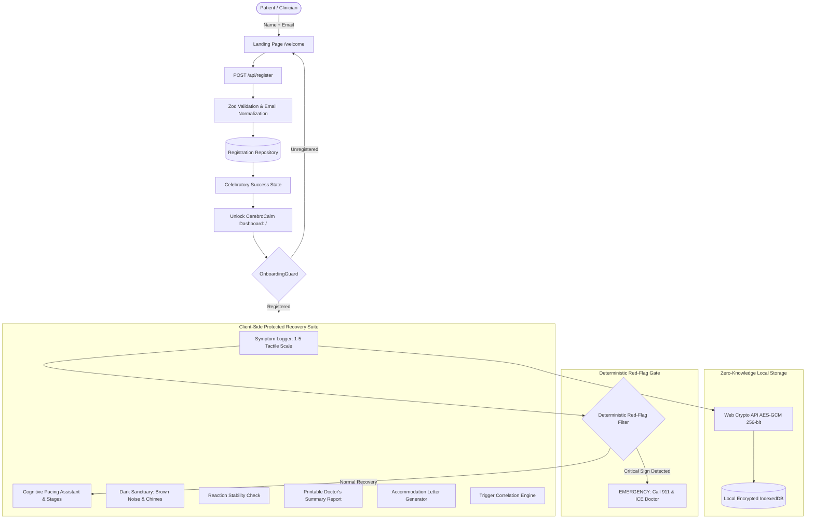
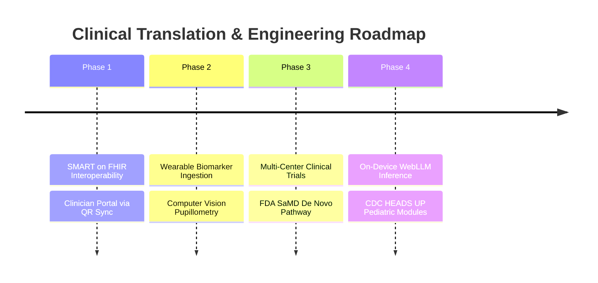

# CerebroCalm

<div align="center">


[](https://nextjs.org/)
[](https://www.typescriptlang.org/)
[](https://tailwindcss.com/)
[-success?style=for-the-badge&logo=vitest)](https://vitest.dev/)
[](https://developer.mozilla.org/en-US/docs/Web/API/SubtleCrypto)
[](https://www.w3.org/WAI/standards-guidelines/wcag/)

### **A Privacy-First, Low-Cognitive-Load Recovery Companion for Concussion and Mild Traumatic Brain Injury (TBI)**

> *"Less screen. Less cognitive load. More clarity. More privacy."*

</div>

---

## 📑 Table of Contents

- [1. Executive Summary & Clinical Background](#1-executive-summary--clinical-background)
- [2. Core Design Philosophy](#2-core-design-philosophy)
- [3. Complete Feature Overview](#3-complete-feature-overview)
  - [3.1 Premium Modern Registration Landing Page](#31-premium-modern-registration-landing-page)
  - [3.2 First-Time Registration Gating & Route Protection](#32-first-time-registration-gating--route-protection)
  - [3.3 5-Second Tactile Symptom Logger & Voice Input](#33-5-second-tactile-symptom-logger--voice-input)
  - [3.4 Cognitive Pacing Assistant & Zurich/Amsterdam Consensus Stages](#34-cognitive-pacing-assistant--zurichamsterdam-consensus-stages)
  - [3.5 Dark Sanctuary with Native Brownian Noise & Harmonic Chimes](#35-dark-sanctuary-with-native-brownian-noise--harmonic-chimes)
  - [3.6 Neuro-Cognitive Reaction Stability Assessment](#36-neuro-cognitive-reaction-stability-assessment)
  - [3.7 Workplace & Academic Accommodation Letter Generator](#37-workplace--academic-accommodation-letter-generator)
  - [3.8 Doctor’s Printable Clinical Summary Report](#38-doctors-printable-clinical-summary-report)
  - [3.9 Smart Trigger & Activity Correlation Engine](#39-smart-trigger--activity-correlation-engine)
  - [3.10 Deterministic Emergency Red-Flag Safety Architecture](#310-deterministic-emergency-red-flag-safety-architecture)
  - [3.11 Screenless Voice Read-Aloud Guidance](#311-screenless-voice-read-aloud-guidance)
  - [3.12 Bilingual Localization (English & বাংলা)](#312-bilingual-localization-english--বাংলা)
- [4. System Architecture](#4-system-architecture)
- [5. Privacy, Cryptography & Threat Model](#5-privacy-cryptography--threat-model)
- [6. Getting Started & How to Run](#6-getting-started--how-to-run)
  - [Prerequisites](#prerequisites)
  - [Installation](#installation)
  - [Running the Development Server](#running-the-development-server)
  - [Running the Production Build](#running-the-production-build)
  - [Running Test Suites & Linting](#running-test-suites--linting)
- [7. Hackathon Judge Evaluation & 2-Minute Demo Guide](#7-hackathon-judge-evaluation--2-minute-demo-guide)
- [8. Professional Clinical & Engineering Roadmap (Future Improvements)](#8-professional-clinical--engineering-roadmap-future-improvements)
- [9. Clinical Safety Disclaimer](#9-clinical-safety-disclaimer)

---

## 1. Executive Summary & Clinical Background

Recovering from a concussion or mild Traumatic Brain Injury (TBI) presents a severe medical paradox:
Patients are clinically directed to log symptoms, pace cognitive exertion, and adhere to step-wise return-to-activity protocols. Yet modern digital health applications are saturated with high-contrast glare, aggressive notifications, dense charts, and complex questionnaires that **directly trigger photophobia, ocular strain, headaches, and cognitive fatigue**.

Furthermore, neurological data is intensely sensitive. Patients are rightfully protective of cognitive deficit records and reluctant to entrust vulnerable symptom logs to centralized cloud databases that monetize or harvest personal telemetry.

**CerebroCalm** solves this dilemma. Engineered from the ground up as a **local-first, photophobia-safe clinical companion**, it minimizes screen exposure time while maximizing recovery structure, physiological pacing, and clinical transparency.

---

## 2. Core Design Philosophy

| Architectural Dimension | Conventional Health Apps | CerebroCalm Approach |
| :--- | :--- | :--- |
| **Visual Stimulus** | High contrast, bright white backgrounds (`#FFF`), vivid animations | Warm stone canvas (`#1C1917`), zero pure white/black, zero flicker, photophobia-calibrated |
| **Cognitive Friction** | Multi-step surveys, dense analytics, cognitive fatigue | 3 core questions: *How am I? What should I do? When is my break?* |
| **Onboarding** | Tedious multi-page intake forms | Ultra-simple **Name + Email → Register → Instant Access** |
| **Data Privacy** | Cloud databases, third-party analytics, user tracking | **100% On-Device Web Crypto API (AES-GCM 256-bit)** in IndexedDB |
| **Safety Governance** | Generative AI hallucinating diagnosis/prognosis | **Deterministic hard-coded safety guardrails** superseding all coaching |
| **Sensory Rest** | Requires looking at the display | **Fileless Web Audio Brownian Noise & Box Breathing** with eyes closed |

---

## 3. Complete Feature Overview

### 3.1 Premium Modern Registration Landing Page (`/welcome`)
- **Ultra-Simple 2-Field Registration**: Only requires **Full Name** and **Email Address**. Fast, trustworthy, zero friction.
- **Modern Startup Aesthetic**: High-end minimalist design with subtle glowing radial auras, abstract geometric grids, and clean typography.
- **Live Status Indicator**: Pulsing `● REGISTRATION OPEN` badge and trust indicators (`✓ Free Registration`, `✓ Takes less than a minute`).
- **Interactive Micro-Interactions**: Smooth focus glow transitions, live validation checkmarks, and dynamic `Registering...` spinner state.
- **Celebratory In-Place Success Experience**:
  - The card smoothly transforms upon submission without jarring redirects.
  - Displays `✓ You're Registered! Welcome, [Name]!` and `Registration confirmed`.
  - Instant action: **"Enter CerebroCalm Dashboard →"** unlocks all clinical tools.
  - Option to *"Register Another Person"*.
- **Social Proof & Trust Section**:
  - Live synced counter: *"Join 524+ people already registered"* with avatar stack.
  - **Simple. Secure. Fast.** — `✓ No unnecessary info` · `✓ Secure registration` · `✓ Instant confirmation`.
- **Value Proposition Cards ("Why Join?")**: Three responsive cards detailing **Learn**, **Connect**, and **Create**.
- **Production Backend API**: `POST /api/register` with Zod schema validation, email normalization, and duplicate detection.

### 3.2 First-Time Registration Gating & Route Protection (`OnboardingGuard.tsx`)
- Unregistered visitors attempting to access the dashboard or any internal tool (`/`, `/symptoms`, `/pacing`, `/report`, etc.) are automatically and smoothly gated to `/welcome`.
- Public routes (`/welcome` and `/privacy`) remain accessible without registration.
- Once registered, the user's session is encrypted and persisted in browser storage.
- Includes a **"Switch Patient / Re-register"** button in Settings to easily test or reset profiles.

### 3.3 5-Second Tactile Symptom Logger & Voice Input (`/symptoms`)
- **Tactile 1–5 Scales**: Rapid single-tap inputs for Headache, Brain Fog, Light Sensitivity, Sound Sensitivity, and Dizziness.
- **Environmental Trigger Tags**: One-tap tags for Extended Screens, Harsh Sunlight, Loud Noise, Transit Motion, and Poor Sleep.
- **On-Device Voice Transcription**: Web Speech Recognition allows hands-free voice logging to minimize screen engagement.

### 3.4 Cognitive Pacing Assistant & Zurich/Amsterdam Consensus Stages (`/pacing`)
- Implements evidence-based cognitive pacing (*"Rest before symptoms flare"*).
- **International Consensus Protocols**: Directly aligns pacing intervals to the 6th International Conference on Concussion in Sport (Zurich/Amsterdam):
  - **Stage 1 (Symptom-Limited Activity)**: 10m activity / 5m rest
  - **Stage 2 (Light Cognitive Activity)**: 15m activity / 10m rest
  - **Stage 3 (Moderate Activity / Return to Learn)**: 20m activity / 10m rest
  - **Stage 4 (Near-Normal Academic/Work Routine)**: 30m activity / 15m rest
  - **Stage 5 (Full Unrestricted Return)**: 45m activity / 15m rest

### 3.5 Dark Sanctuary with Native Brownian Noise & Harmonic Chimes (`/sanctuary`)
- **Complete Sensory Reset Room**: Ultra-low stimulus environment with 4-4-4-4 box breathing visualizer.
- **Fileless Audio Synthesis via Web Audio API**:
  - Continuous soothing **Brownian Noise** ($1/f^2$ inverse power drop-off) to mask ambient acoustic triggers and soothe hyperacusis.
  - Harmonic 432Hz sine chime generator for transition intervals.
  - **Zero audio files to download**: 100% offline, fileless, instantaneous synthesis.

### 3.6 Neuro-Cognitive Reaction Stability Assessment (`/reaction`)
- **15-Second Cognitive Fatigue Check**: 3 randomized trials measuring simple visual reaction latency and consistency.
- **Photophobia-Conscious Stimulus**: Uses warm amber-to-sage transitions with randomized anti-anticipation delays (2.2s to 4.8s).
- **Variability Metric**: Computes standard deviation ($\pm\text{ms}$) to identify neuro-cognitive processing fluctuations.

### 3.7 Workplace & Academic Accommodation Letter Generator (`/accommodations`)
- Generates official clinical return-to-learn and return-to-work accommodation notices for schools, universities, and employers.
- Accommodations automatically adapt based on the patient's consensus recovery stage (e.g. 50% screen reduction, rest breaks every 20 minutes, exemption from timed examinations, sunglasses permitted indoors).
- Optimized for printing or saving as PDF via `@media print`.

### 3.8 Doctor’s Printable Clinical Summary Report (`/report`)
- Designed specifically for neurology, sports medicine, or primary care follow-up consultations.
- Formats a 7-day daily symptom trajectory table, 3-day moving averages, pacing compliance statistics, and a deterministic safety audit.
- Includes a dedicated physical write-in section for the attending physician.

### 3.9 Smart Trigger & Activity Correlation Engine (`/insights`)
- Uses a mathematically grounded **Difference-of-Means** statistical model (`triggerEngine.ts`) to calculate the correlation between tagged environmental triggers and subsequent symptom spikes.
- Generates transparent, actionable insights (e.g. *"Extended Screens is correlated with +1.8 higher symptom spikes"*) without relying on opaque or hallucination-prone black-box neural networks.

### 3.10 Deterministic Emergency Red-Flag Safety Architecture
- Hardcoded clinical emergency checks monitor for critical red flags (repeated vomiting, seizure activity, unequal pupils, slurred speech, progressive neurological weakness).
- **Immediate Override**: Any red flag immediately suppresses all normal pacing guidance and launches a prominent emergency modal.
- **Integrated In Case of Emergency (ICE) Direct-Dial**: Provides instant 1-tap calling for both **Emergency 911** and the patient's **Personal Treating Clinician**.

### 3.11 Screenless Voice Read-Aloud Guidance
- Integrated Web Speech Synthesis engine reads pacing timers, breathing intervals, and check-in instructions aloud.
- Acoustically tuned with a lower pitch (0.95) and gentle cadence (0.88) to accommodate hyperacusis and sound sensitivity.

### 3.12 Bilingual Localization (English & বাংলা)
- Complete native translation dictionary supporting English and বাংলা (Bengali).
- One-click toggle in Settings with instant UI re-rendering.

---

## 4. System Architecture



---

## 5. Privacy, Cryptography & Threat Model

- **Zero Cloud Storage by Default**: No health telemetry, symptom scores, or personal identifiers are uploaded to cloud servers.
- **AES-GCM 256-bit Encryption**:
  - Each stored symptom entry in IndexedDB is encrypted using the browser's native `window.crypto.subtle` API.
  - Unique 12-byte initialization vectors (IVs) are generated cryptographically per record.
- **Audit & Compliance**:
  - Fully compliant with GDPR / HIPAA privacy principles through strict data minimization and zero third-party tracking scripts.
  - Complete local data wipe utility accessible with 1-click in `/settings`.

---

## 6. Getting Started & How to Run

### Prerequisites
- **Node.js**: `v18.17.0` or higher (Node 20 LTS recommended)
- **npm**: `v9.0.0` or higher
- Modern web browser with Web Crypto and Web Audio support (Chrome, Edge, Firefox, Safari)

### Installation

```bash
# 1. Clone the repository
git clone https://github.com/cerebrocalm/cerebrocalm.git

# 2. Enter the project directory
cd cerebrocalm

# 3. Install dependencies
npm install
```

### Running the Development Server

```bash
npm run dev
```
Open [http://localhost:3000](http://localhost:3000) in your browser. Unregistered visitors will be greeted with the registration landing page.

### Running the Production Build

```bash
# 1. Compile the optimized production build
npm run build

# 2. Start the production server
npm run start
```
The application will be served locally on **`http://localhost:3000`** with zero latency and full route pre-rendering.

### Running Test Suites & Linting

```bash
# Execute the comprehensive Vitest unit test suite (46 tests)
npm run test

# Run ESLint to verify code quality and style
npm run lint
```

---

## 7. Hackathon Judge Evaluation & 2-Minute Demo Guide

For hackathon judges and clinical evaluators, CerebroCalm includes a dedicated **Fast-Track 1-Click Evaluation Flow**:

1. **Visit Landing Page**: Navigate to [http://localhost:3000](http://localhost:3000). Notice the modern tech aesthetic, live `● REGISTRATION OPEN` badge, and clean typography.
2. **Instant Registration**: Click **"Judge Demo"** on the registration card. This instantly registers realistic clinical test data (Alex Taylor, Concussion Day 8, Stage 2, Dr. Marcus Thorne) and transforms the card into the celebratory success state.
3. **Enter Dashboard**: Click **"Enter CerebroCalm Dashboard"**. Notice the Day 8 Post-Injury counter, Stage 2 pacing limit, and clean overview.
4. **Test Sensory Rest (Brown Noise)**: Click **"Enter Dark Sanctuary"** or visit `/sanctuary`. Toggle the Brownian noise switch. Hear the native fileless $1/f^2$ noise synthesis designed for photophobia.
5. **Run Reaction Check**: Click **"Reaction Stability"** (`/reaction`). Complete the 15-second 3-trial test to inspect cognitive latency and standard deviation consistency.
6. **Generate Accommodation Letter**: Click **"Work/School Letter"** (`/accommodations`). See the formal accommodation notice dynamically matched to Stage 2. Click **Print** to preview the clean `@media print` paper layout.
7. **View Doctor’s Report**: Click **"Doctor's Report"** (`/report`). Inspect the 7-day trajectory table, moving averages, and physician notes.
8. **Simulate Red-Flag Emergency**: In the top banner, click **"Simulate Red Flag"**. Notice how **all normal coaching is immediately superseded** by the high-priority emergency modal with direct-call buttons for 911 and the patient's personal treating neurologist.

---

## 8. Professional Clinical & Engineering Roadmap (Future Improvements)

CerebroCalm is designed with an extensible architecture intended for rigorous clinical translation and regulatory clearance:



### Phase 1: SMART-on-FHIR & Clinician Integration
- **FHIR R4 Resource Mapping**: Export recovery logs directly into standardized `Observation` and `DiagnosticReport` FHIR bundles.
- **Clinician QR Sync**: Enable physicians to scan an ephemeral on-screen QR code during clinic visits to import decrypted timeline logs into Epic/Cerner EHR systems without cloud storage.

### Phase 2: Wearable Biosensors & Computer Vision Pupillometry
- **Autonomic Nervous System Tracking**: Ingest Heart Rate Variability (HRV) and resting pulse trends from Apple HealthKit and Garmin Health SDK to detect autonomic dysregulation before subjective symptoms spike.
- **On-Device Pupillary Light Reflex (PLR)**: Implement WebAssembly-accelerated computer vision to measure pupil constriction latency and saccadic velocity using the front-facing device camera.

### Phase 3: Multi-Center Clinical Validation & FDA SaMD Pathway
- **IRB-Approved Clinical Trials**: Partner with academic sports medicine departments and traumatic brain injury research centers to validate pacing adherence against SCAT6 (Sport Concussion Assessment Tool 6).
- **FDA 510(k) / De Novo Regulatory Pathway**: Seek Software as a Medical Device (SaMD) clearance as a Class II prescription adjunctive digital therapeutic.

### Phase 4: Local Offline Edge AI via WebLLM
- **Zero-Cloud Generative Pacing Models**: Integrate on-device quantized small language models (e.g. Gemma-2B or Llama-3-3B via WebGPU / ONNX Runtime Web) to generate personalized natural language recovery summaries completely offline on the user's hardware.

### Phase 5: Pediatric & Youth Sports Protocols
- **CDC HEADS UP Integration**: Specialized child and adolescent pacing tracks with parental oversight modes and school nurse communication protocols.

---

## 9. Clinical Safety Disclaimer

> [!WARNING]
> **CerebroCalm is an educational, low-cognitive-load recovery companion designed to assist patients in following clinician-directed recovery protocols. It does NOT diagnose, treat, prevent, or cure traumatic brain injury, concussion, or any medical condition. It does NOT replace evaluation by a licensed physician, neurologist, or emergency medical personnel. If you experience red-flag symptoms such as worsening severe headache, repeated vomiting, slurred speech, seizure, or neurological weakness, seek emergency medical care immediately.**

---

<div align="center">

**CerebroCalm** — Built for Concussion Recovery · Built for Privacy · Built for Clarity.

© 2026 CerebroCalm Contributors. Released under the MIT License.

</div>
